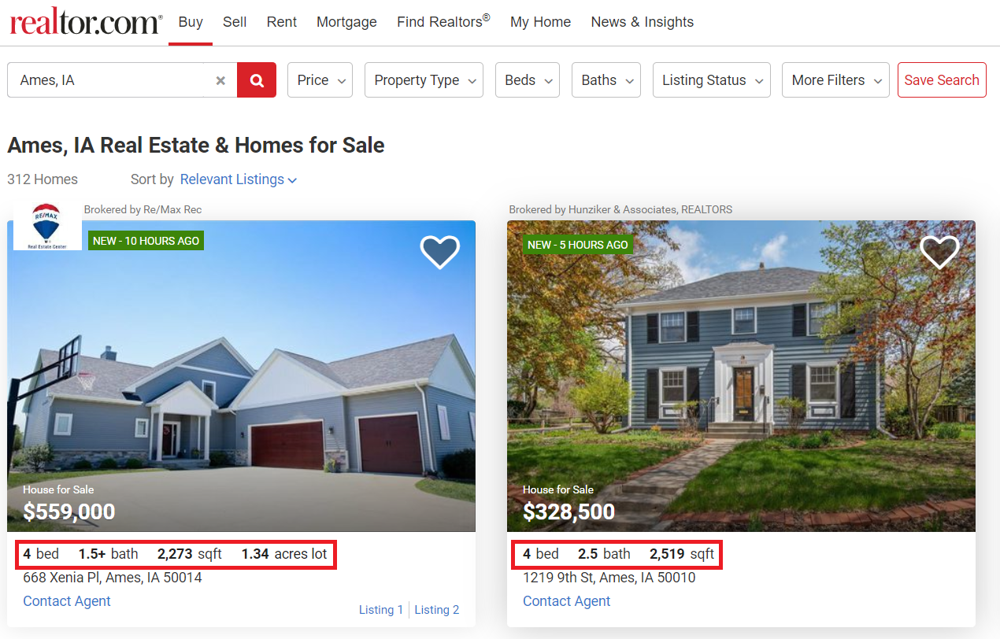
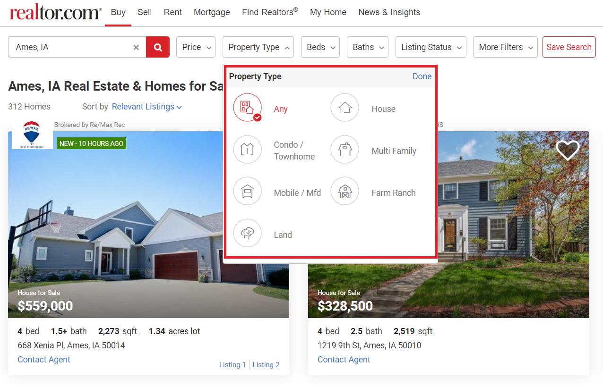
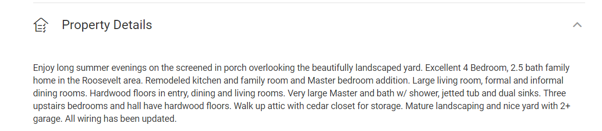

```{r setup, include=FALSE}
knitr::opts_chunk$set(echo = TRUE)
```

***

## Group members

- Shane Taylor shanemt2@illinois.edu 
- Zhouning Ma zm11@illinois.edu 
- Kevin Mackie kevindm2@illinois.edu

***

# Introduction

This project is a linear regression analysis of housing prices, based on a publicly available data set on housing prices in the city of Ames, Iowa, that was curated by Dean De Cock of Truman state university.

* https://www.kaggle.com/c/house-prices-advanced-regression-techniques/overview
* http://jse.amstat.org/v19n3/decock.pdf

For this project, our goal will be to attempt to find, using a variety of statistical modelling techniques in R, a "good" (below) linear regression model that both performs well and is easily interpretable for explanatory purposes.

A "**good model**" should:

* Have a Mean Absolute Percentage Error less than 15%, and preferably 10% or lower
* Adhere to LINE assumptions for linear regression i.e. has constant variance and demonstrates normality
* Has no destabilizing collinearity among the predictors i.e. no VIF >= 5

## Data set 

The data set consists of 1460 observations with one numerical response (house price) and 80 predictors. The predictors are a relatively even mix of numerical and categorical variables.

The predictors are summarized in the following table:

| Variable name | Description | Factor Levels |
| --- | --- | ---- |
|SalePrice | the property's sale price in dollars. This is the target variable that you're trying to predict.|
|mssubclass| the building class | |
|MSZoning| The general zoning classification |C (all), FV, RH, RL, RM |
|LotFrontage| Linear feet of street connected to property|
|LotArea| Lot size in square feet|
|Street| Type of road access |Grvl, Pave |
|Alley| Type of alley access |Grvl, Pave |
|LotShape| General shape of property |IR1, IR2, IR3, Reg |
|LandContour| Flatness of the property |Bnk, HLS, Low, Lvl |
|Utilities| Type of utilities available |AllPub, NoSeWa |
|LotConfig| Lot configuration |Corner, CulDSac, FR2, FR3, Inside |
|LandSlope| Slope of property |Gtl, Mod, Sev |
|Neighborhood| Physical locations within Ames city limits |Blmngtn, Blueste, ...|
|Condition1| Proximity to main road or railroad |Artery, Feedr, Norm, PosA, ...|
|Condition2| Proximity to main road or railroad (if a second is present) |Artery, Feedr, ... |
|BldgType| Type of dwelling |1Fam, 2fmCon, Duplex, Twnhs, TwnhsE |
|HouseStyle| Style of dwelling |1.5Fin, 1.5Unf, 1Story, 2.5Fin, 2.5Unf, 2Story, SFoyer, SLvl |
|OverallQual| Overall material and finish quality|
|OverallCond| Overall condition rating|
|YearBuilt| Original construction date|
|YearRemodAdd| Remodel date|
|RoofStyle| Type of roof |Flat, Gable, Gambrel, Hip, Mansard, Shed |
|RoofMatl| Roof material |ClyTile, CompShg, Membran, Metal, Roll, Tar&Grv, WdShake, WdShngl |
|Exterior1st| Exterior covering on house |AsbShng, AsphShn, BrkComm, BrkFace, CBlock, ... |
|Exterior2nd| Exterior covering on house (if more than one material) |AsbShng, AsphShn, ... |
|MasVnrType| Masonry veneer type |BrkCmn, BrkFace, None, Stone |
|MasVnrArea| Masonry veneer area in square feet|
|ExterQual| Exterior material quality |Ex, Fa, Gd, TA |
|ExterCond| Present condition of the material on the exterior |Ex, Fa, Gd, Po, TA |
|Foundation| Type of foundation |BrkTil, CBlock, PConc, Slab, Stone, Wood |
|BsmtQual| Height of the basement |Ex, Fa, Gd, TA |
|BsmtCond| General condition of the basement |Fa, Gd, Po, TA |
|BsmtExposure| Walkout or garden level basement walls |Av, Gd, Mn, No |
|BsmtFinType1| Quality of basement finished area |ALQ, BLQ, GLQ, LwQ, Rec, Unf |
|BsmtFinSF1| Type 1 finished square feet|
|BsmtFinType2| Quality of second finished area (if present) |ALQ, BLQ, GLQ, LwQ, Rec, Unf |
|BsmtFinSF2| Type 2 finished square feet|
|BsmtUnfSF| Unfinished square feet of basement area|
|TotalBsmtSF| Total square feet of basement area|
|Heating| Type of heating |Floor, GasA, GasW, Grav, OthW, Wall |
|HeatingQC| Heating quality and condition |Ex, Fa, Gd, Po, TA |
|CentralAir| Central air conditioning |N, Y |
|Electrical| Electrical system |FuseA, FuseF, FuseP, Mix, SBrkr |
|1stFlrSF| First Floor square feet|
|2ndFlrSF| Second floor square feet|
|LowQualFinSF| Low quality finished square feet (all floors)|
|GrLivArea| Above grade (ground) living area square feet|
|BsmtFullBath| Basement full bathrooms|
|BsmtHalfBath| Basement half bathrooms|
|FullBath| Full bathrooms above grade|
|HalfBath| Half baths above grade|
|Bedroom| Number of bedrooms above basement level|
|Kitchen| Number of kitchens|
|KitchenQual| Kitchen quality |Ex, Fa, Gd, TA |
|TotRmsAbvGrd| Total rooms above grade (does not include bathrooms)|
|Functional| Home functionality rating |Maj1, Maj2, Min1, Min2, Mod, Sev, Typ |
|Fireplaces| Number of fireplaces|
|FireplaceQu| Fireplace quality |Ex, Fa, Gd, Po, TA |
|GarageType| Garage location |2Types, Attchd, Basment, BuiltIn, CarPort, Detchd |
|GarageYrBlt| Year garage was built|
|GarageFinish| Interior finish of the garage |Fin, RFn, Unf |
|GarageCars| Size of garage in car capacity|
|GarageArea| Size of garage in square feet|
|GarageQual| Garage quality |Ex, Fa, Gd, Po, TA |
|GarageCond| Garage condition |Ex, Fa, Gd, Po, TA |
|PavedDrive| Paved driveway |N, P, Y |
|WoodDeckSF| Wood deck area in square feet|
|OpenPorchSF| Open porch area in square feet|
|EnclosedPorch| Enclosed porch area in square feet|
|3SsnPorch| Three season porch area in square feet|
|ScreenPorch| Screen porch area in square feet|
|PoolArea| Pool area in square feet|
|PoolQC| Pool quality |Ex, Fa, Gd |
|Fence| Fence quality |GdPrv, GdWo, MnPrv, MnWw |
|MiscFeature| Miscellaneous feature not covered in other categories |Gar2, Othr, Shed, TenC |
|MiscVal| $Value of miscellaneous feature|
|MoSold| Month Sold|
|YrSold| Year Sold|
|SaleType| Type of sale |COD, Con, ConLD, ConLI, ConLw, CWD, New, Oth, WD |
|SaleCondition| Condition of sale |Abnorml, AdjLand, Alloca, Family, Normal, Partial |

***

# Methods

## Approach to Problem (Utilizing Real Estate Websites)

$$
\begin{align*}
Hypothesis : \ \ &\text{Using only the characteristics most prominently displayed across typical real estate websites,}\\
&\text{we can build a "good" (as described above) linear model for predicting home prices.}
\end{align*}
$$
Looking at the default view of some of the listings on realtor.com, we can see that the following information is displayed.



- \# of bed rooms
- \# of bath rooms
- Total square footage
- Lot square footage (some listings only)

Other realtor websites such as zillow.com, redfin.com, etc. also show similar data for each listing. The fact that all of these different websites display the same default data tells us that it is likely that these are the most important aspects of a house for a potential buyer. Under our hypothesis, we assume these are highly correlated with the sale price. 

Additionally, the various realtor websites allow one specify the dwelling type, such as condo, house, aparment, etc. This suggests these will be important characteristics as well. 



The top options under the website filters include the age of home, the number of stories, and whether it has heating or cooling.


Taking all of this into account, we will build a model using the information most prominently featured on realtor websites. The initial numeric variables that we will use in this approach are: 

* square footage of the house
* lot size
* age of the home
* number of bathrooms and bedrooms.

We consider a small subset of factor variables that seem the most likely to determine price, these include  type of building (`BldgType`), the style of the home (`HouseStyle`), and the inclusion of heating and central AC. 

Also, note that two of the variables in the data are `OverallQual` and `OverallCond`. It's not too much of a stretch to assume that the overall quality of the construction of the house, and the condition of the house would also factor into the asking price for the home. But the way this information is displayed on the website is not with a number, but typically with a paragraph or two, such as:




We will be using the presence of descriptive paragraphs such as these to support my ability to include these two variables under my hypothesis. Essentially we will be assuming that the score given by `OverallCond` and `OverallQual` is more or less an accurate heuristic for converting these sorts of descriptions into a number.

## Library

```{r message=FALSE, warning=FALSE}
library(tidyverse)
library(lmtest)
library(faraway)
library(MASS)
library(corpcor)
library(corrplot)
library(ggcorrplot)

library(GGally)
library(leaps)
library(knitr)
library(kableExtra)
library(caret)
library(outliers)
library(ggplot2)
library(ggthemes)
```

## Public Functions

```{r}
diagnostics = function(model, pcol = "grey", lcol = "dodgerblue"){
  par(mfrow = c(1,2))
  plot(fitted(model), resid(model), col = pcol, pch = 20,
       xlab = "Fitted", ylab = "Residuals", main = paste("Fitted Vs Residuals"))
  abline(h = 0, col = lcol, lwd = 2)
  qqnorm(resid(model), col = pcol)
  qqline(resid(model), lty = 2, lwd = 2, col = lcol)
}

mape = function(actual, pred){
  mean(abs((actual - pred) / actual)) * 100
}

get_loocv_rmse = function(model) {
  sqrt(mean((resid(model) / (1 - hatvalues(model))) ^ 2))
}

get_adj_r2 = function(model) {
  summary(model)$adj.r.squared
}

kfold_cv = function(data, model, k, log_response = FALSE) {
  set.seed(600)
  # Get indices for k folds (the data to be held out)
  holdouts = split(sample(1:nrow(data)), 1:k)
  
  total_mape = 0
  
  # Now for each holdout fit a model to the data not held out, and test against held out data
  for (holdout in holdouts) {
    train = data[-c(holdout),]
    test = data[c(holdout),]
    m = lm(formula(model), data = train)
    pred = predict(m, newdata = test)
    if (log_response) {
      total_mape = total_mape + mape(test$SalePrice, exp(pred))
    } else {
      total_mape = total_mape + mape(test$SalePrice, pred)
    }
  }
  total_mape / k
}

```

## Loading the data

We load the "train.csv" file and observe the available variables.

```{r}
house_prices_full = read.csv("train.csv")
#str(house_prices_full)
```

Note that there is also a "test.csv" file, but it does not contain the `SalePrice` response variable. We split the data from "train.csv" randomly into a 75/25 train/test split as `house_prices` and `house_prices_test`. We will train our models on `house_prices` and evaluate our final model in terms of how well it works to make predictions on `house_prices_test`.

```{r}
set.seed(08032019)
house_prices_idx  = sample(nrow(house_prices_full), size = trunc(0.75 * nrow(house_prices_full)))
house_prices = house_prices_full[house_prices_idx, ]
house_prices_test = house_prices_full[-house_prices_idx, ]
```

## Initial variable selection and additive model

Based on our above real-world assumptions and review of realtor websites, we make the following initial variable selection:

- GrLivArea: Above grade (ground) living area square feet
- LotArea: Lot size in square feet
- TotalBsmtSF: Total square feet of basement area
- BsmtUnfSF: Unfinished square feet of basement area
- GarageArea: Size of garage in square feet
- BedroomAbvGr: Number of bedrooms above basement level
- FullBath: Full bathrooms above grade
- HalfBath: Half baths above grade
- BsmtFullBath: Basement full bathrooms
- BsmtHalfBath: Basement half bathrooms
- BldgType: Type of dwelling : factors = { 1Fam, 2fmCon, Duplex, Twnhs, TwnhsE }
- HouseStyle: Style of dwelling : factors = { 1.5Fin, 1.5Unf, 1Story, 2.5Fin, 2.5Unf, 2Story, SFoyer, SLvl }
- OverallQual: Overall material and finish quality
- OverallCond: Overall condition rating
- YearBuilt: Original construction date
- Heating: Type of heating : factors = { Floor, GasA, GasW, Grav, OthW, Wall }
- CentralAir: Central air conditioning : factors = { N, Y }

We first build a large additive model that includes all of the above predictors.

```{r}
house_prices.lm = lm(SalePrice ~ GrLivArea + LotArea + GarageArea + BedroomAbvGr + FullBath + HalfBath + TotalBsmtSF + OverallQual + OverallCond + YearBuilt + BldgType + HouseStyle + CentralAir + Heating, data = house_prices)
```

### Mean absolute percentage error

We then test this model using a training data set and a k-fold cross validation.

```{r}
(mape1 = kfold_cv(house_prices, house_prices.lm, 5))
```

The reported error for this initial model is `r mape1`. 

### Model diagnostics

Let's look at the Fitted Vs Residuals Plot and the Normal Q-Q Plot.

```{r}
diagnostics(house_prices.lm)
```

We can see that the constant variance assumption seems to be violated, since the variation increases as you move to the right, The fitted vs residuals plot also exhibits a crescent shape indicating non-linearly. It seems clear that the there is an underlying pattern to the variance, indicating that a transformation might be applicable. Since the variation seems to grow exponentially as it moves to the right, we suspect that a log transformation of the reponse may be effective.

## Log transform of response

We fit a model using the log of the response (sale price), and assess the diagnostic plots for the log-response model.

```{r}
house_prices.lm = lm(log(SalePrice) ~ GrLivArea + LotArea + GarageArea + BedroomAbvGr + FullBath + HalfBath + TotalBsmtSF + OverallQual + OverallCond + YearBuilt + BldgType + HouseStyle + CentralAir + Heating, data = house_prices)
diagnostics(house_prices.lm)
```

It appears that a log transformation of the response did help make the distribution of error more equal and normal than before. 

We now check this new model's MAPE for accuracy:

```{r}
(mape2 = kfold_cv(house_prices, house_prices.lm, 5, log_response = TRUE))
```

We see that this model's error of `r mape2`% has improved slightly relative to the original (non-log-transformed) version. 

## Significance of predictors

We check the model for the significance of the predictors by doing a t-test of each parameter, using an $\alpha = 0.10$ for significance.

```{r}
summary(house_prices.lm)
```

We see that there are numerous $\beta$-parameters with high p-values, such as for example `BedroomAbvGr`, `Heating`, and `HouseStyle`. We attempt to remove these and see if our model improves.

```{r}
house_prices.lm = lm(log(SalePrice) ~ GrLivArea + LotArea + GarageArea + FullBath + HalfBath + TotalBsmtSF + OverallQual + OverallCond + YearBuilt + BldgType + CentralAir, data = house_prices)
summary(house_prices.lm)
```

Now all of our $\beta$-parameters, apart from the dummy variable for `BldgType2fmCon` seem to be significant. Because the other dummy variables seem to be significant, we'll leave `BldgType` in. 

Let's look at the Fitted Vs Residuals and the Q-Q Plot for this new model

```{r}
diagnostics(house_prices.lm)
```

The variance looks consistent from left to right. When looking at the Q-Q Plot we can see that there seems to be some significant deviation from the line towards the left side of the graph. 


We also check cross-validated MAPE:

```{r}
(mape3 = kfold_cv(house_prices, house_prices.lm, 5, log_response = TRUE))
```

We see that the performance of our regression continues to improve, with a cross-validated MAPE of `r mape3`. 

## Analysis of outliers

We still have an issue with our model diagnostics, as the Normal Q-Q plot still shows substantial deviation from normal for our residuals.

OUr log response transformation has not worked to correct the problem and so we now turn to outliers.

We examune a plot showing leverage, standardized residuals, and Cook's distance (red dotted lines).

```{r}
plot(house_prices.lm, which = 5)
```

There is one quite extreme outlier in observation #1299. Looking at the underlying data, we see that the data quality of this point is highly questionable. We conclude that this point can be safely removed from the data set.

```{r}
influential_indices = as.vector(which(cooks.distance(house_prices.lm) > 4/length(cooks.distance(house_prices.lm))))
house_prices_outliers_removed.lm = lm(log(SalePrice) ~ GrLivArea + LotArea + GarageArea + FullBath + HalfBath + TotalBsmtSF + OverallQual + OverallCond + YearBuilt + BldgType + CentralAir, data = house_prices[-influential_indices[1], ])
diagnostics(house_prices_outliers_removed.lm)
```

Removing this one observation did improve the Normal Q-Q plot, but not enough to convince us that our residuals follow a normal distribution.

We check the new model accuracy:

```{r}
(mape4 = kfold_cv(house_prices[-influential_indices[1],], house_prices_outliers_removed.lm, 547, log_response = TRUE))
``` 

With the removal of a single bad observation we have improved the model performance substantially. We now have a MAPE of `r mape4`, exceeding our original goal for the project. We have a very good model for prediction performance.

## Removal of outliers to correct violations of LINE assumptions

Our diagnostic plots are still not entirely satisfactory. Let's continue our analysis of outliers.

```{r}
plot(house_prices_outliers_removed.lm, which = 5)
```

We see that there are still significant outliers in the model. We will now fit our model after removing all outliers (defined as those points have a Cook's distance of > 4/n).

```{r}
influential_indices = as.vector(which(cooks.distance(house_prices.lm) > 4/length(cooks.distance(house_prices.lm))))
house_prices_outliers_removed.lm = lm(log(SalePrice) ~ GrLivArea + LotArea + GarageArea + FullBath + HalfBath + TotalBsmtSF + OverallQual + OverallCond + YearBuilt + BldgType + CentralAir, data = house_prices[-influential_indices, ])
diagnostics(house_prices_outliers_removed.lm)
```

The results are satisfying, at least visually. We have plots that give some confidence of having equal variance and normal distribution of error. 

```{r}
bptest(house_prices_outliers_removed.lm)
shapiro.test(resid(house_prices_outliers_removed.lm))
```

While we would still have to reject the null hypothesis with these two tests and conclude that it is unlikely that our error distribution is equal and normal, the performance is better than the unmodified original model.

We now look at how this model based on removing outliers performs using k-fold cross validation:

```{r}
length(coef(house_prices_outliers_removed.lm))
(mape5 = kfold_cv(house_prices[-influential_indices, ], house_prices_outliers_removed.lm, 6, log_response = TRUE))
``` 

Our k-fold cross-validation shows that performance on this model is very good, `r mape5`%.

***

```{r}
summary(house_prices_outliers_removed.lm)
```

## Simplifying the model

We are satisfied with model prediction performance, and so we check to see if the model can be simplified further using automated techniques like stepwise AIC and BIC automated model selection.

### Backwards AIC

We start with our model and try backwards AIC.

```{r}
house_prices_outliers_removed.lm = lm(log(SalePrice) ~ GrLivArea + LotArea + GarageArea + BedroomAbvGr + FullBath + HalfBath + TotalBsmtSF + OverallQual + OverallCond + YearBuilt + BldgType + HouseStyle + CentralAir + Heating, data = house_prices[-influential_indices,])
house_prices_outliers_removed.lm = step(house_prices_outliers_removed.lm, direction = "backward", trace = 0)
summary(house_prices_outliers_removed.lm)
```

```{r}
length(coef(house_prices_outliers_removed.lm))
(mape6 = kfold_cv(house_prices[-influential_indices,], house_prices_outliers_removed.lm, 6, log_response = TRUE))
```

We see that AIC performance is marginally better (`r mape6`) with one fewer predictor (full bath).

### Backwards BIC

Similarly, we try backwards BIC.

```{r}
house_prices_outliers_removed.lm = lm(log(SalePrice) ~ GrLivArea + LotArea + GarageArea + BedroomAbvGr + FullBath + HalfBath + TotalBsmtSF + OverallQual + OverallCond + YearBuilt + BldgType + HouseStyle + CentralAir + Heating, data = house_prices[-influential_indices,])
house_prices_outliers_removed.lm = step(house_prices_outliers_removed.lm, direction = "backward", k = log(nrow(house_prices[-influential_indices,])), trace = 0)
summary(house_prices_outliers_removed.lm)
```

```{r}
length(coef(house_prices_outliers_removed.lm))
(mape7 = kfold_cv(house_prices[-influential_indices,], house_prices_outliers_removed.lm, 6, log_response = TRUE))
```

We see that the resulting model performs well (`r mape7` - only fractionally better than our originally proposed model), and uses one less predictor (full bath) than our original model.

This is identical to the AIC-based model, above.

### Analysis of correlation

The exclusion of "full bath" from our new model is not suprising when you observe the t-tests for full bath in the preceding sections. This does suggest that the variable is insignificant. We look at a plot of correlation to see if it brings insight into the data.

```{r}
X_numeric = na.omit(house_prices[sapply(house_prices, is.numeric)])
correlation = round(cor(X_numeric, use = "everything"), 4)
```

Now plot the correlations:

```{r correlation_plot}
corrplot(correlation, type = "upper", tl.pos = "td",
         method = "circle", tl.cex = 0.5, tl.col = 'black',
         diag = FALSE)
```

Indeed, we see here that the number of full baths is strongly positively correlated with with general living area and overall quality of the home. Since both of those variables are already in our model, it is not surprising that full bath is somewhat superfluous.

***

# Results

We have selected a final model and validated its performance and adherence to LINE assumptions. We finally demonstrate the performance of the model and its diagnostics. 

## Performance against held out 25% of test data

Let's see how this model performs for making predictions against our test data.

```{r}
influential_indices = as.vector(which(cooks.distance(house_prices.lm) > 4/length(cooks.distance(house_prices.lm))))
house_prices_outliers_removed.lm = lm(log(SalePrice) ~ GrLivArea + LotArea + GarageArea + FullBath + HalfBath + TotalBsmtSF + OverallQual + OverallCond + YearBuilt + BldgType + CentralAir, data = house_prices[-influential_indices, ])
```

```{r}
house_prices_prediction = exp(predict(house_prices_outliers_removed.lm,
                                  newdata = house_prices_test))

```

```{r}
mape(actual = house_prices_test$SalePrice, house_prices_prediction)
```

A `r round(mape(actual = house_prices_test$SalePrice, house_prices_prediction), 2)`% error falls within our target goal interval of 15% and ideally under 10%. We did not remove outliers from the test data and so it is not surprising that performance is slightly worse than we we saw during cross-validated testing of our training set.

## Final model diagnostics (for LINE assumptions)

One of our other goal was for the the model to adhere to LINE assumptions. We can see in the Fitted Vs Residuals and Q-Q Plot that the model demonstrates both normality and relatively constant variance.

```{r}
diagnostics(house_prices_outliers_removed.lm)
```

### Adjusted R-squared

Adjusted $R^2$ value is:

```{r}
get_adj_r2(house_prices_outliers_removed.lm)
```

The model is excellent from this standpoint, with over 92% of the variance in responses being accounted for by our regression.

### Collinearity

Finally, we wanted to ensure that our model was stable and did not contain collinearity.

We calculate the Variance Inflation Factor for our parameters.

```{r}
vif(house_prices_outliers_removed.lm)
```

We can see that all of vif's are less than 5, indicating that multicollinearity should not be an issue with the model.

***

# Discussion

Due to the overwhelming number of variables in this data set, we felt it was best to select a probable set of variables based on domain insight gleaned from study of real estate websites. We used statistical analysis to confirm our choices and to tune the model appropriately. The reasoning being this approach is simple: the things that a buyer values in a home are likely propotional to the cost. Real estate offices and websites have likely narrowed down the things that are important to buyers so that the buyers can find a home easily and make a purchase through them. 

Since all of the houses in this data set came from the same geographic area (Ames, Iowa), we can assume that the physical characteristics of the house determined its price, as opposed to the comparison of prices being driven by the housing market in which it resides (i.e. comparing prices in completely different markets, such as, South Dakota and southern California). 

Our approach was incremental, starting with a proposed model and then using cross-validation and model diagnostics to continually refine the model and improve its characteristics. 

As we could see from the small average percent error and high $R^2$ of our model, the characteristics most prominently featured on a real estate website were highly correlated with the price of the home. 

In conclusion, the model performs well across multiple metrics, adhere adequately to LINE assumptions, and makes quite accurate predictions. This gives evidence to support the hypothesis that a good model can be made from the most prominent features displayed on real estate websites.
