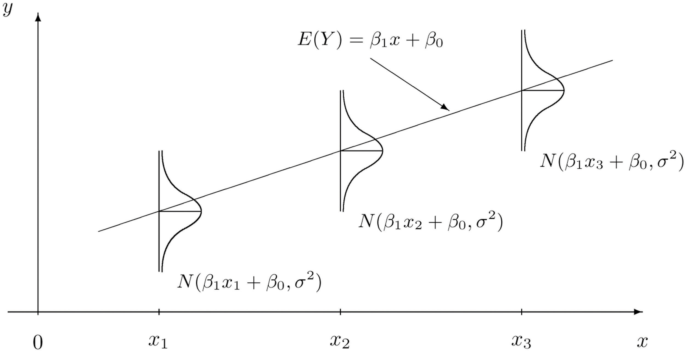

```{r, message=FALSE}
library(tidyverse)
```


***

## Exercise 1 (Using `lm`)

For this exercise we will use the `cats` dataset from the `MASS` package. You should use `?cats` to learn about the background of this dataset.

**(a)** Suppose we would like to understand the size of a cat's heart based on the body weight of a cat. Fit a simple linear model in `R` that accomplishes this task. Store the results in a variable called `cat_model`. Output the result of calling `summary()` on `cat_model`.

***

##### **Solution 1a**

```{r, message=FALSE}
library(MASS)
cats = MASS::cats

head(cats)

```

We can see that we have two variables of interest, Bwt and Hwt. Since we want to measure the effect of the body weight on the heart weight, we will consider `Bwt` as `x` and `Hwt` as `y`. 

First, let's see a simple plot `Bwt` vs `Hwt`

```{r}
plot(cats$Bwt, cats$Hwt,
     xlab = "Body weight (kilograms)",
     ylab = "Heart weight (grams)",
     main = "Body weight vs Heart weight in cats",
     pch = 20,
     cex = 2,
     col = "dodgerblue")
```

Mathematically $\hat{\beta_0}$ and $\beta_1$ can be represented as [follows](http://daviddalpiaz.github.io/appliedstats/simple-linear-regression.html#least-squares-approach):

$$
\begin{aligned}
\hat{\beta}_1 &= \frac{\sum_{i = 1}^{n} x_i y_i - \frac{(\sum_{i = 1}^{n} x_i)(\sum_{i = 1}^{n} y_i)}{n}}{\sum_{i = 1}^{n} x_i^2 - \frac{(\sum_{i = 1}^{n} x_i)^2}{n}} = \frac{S_{xy}}{S_{xx}}\\
\hat{\beta}_0 &= \bar{y} - \hat{\beta}_1 \bar{x}
\end{aligned}
$$

I wanted to attempt to build some functions to perform the linear regression instead of just using `lm()`. I will then use `lm()` to verify my calculations. We can translate the math above into vectorized operations as such:

```{r}
# trims x and y so they are complete and calculates beta_hat_1 and beta_hat_0
# returns:
#   bhat1 : the slope of the SLR line
#   bhat0 : the initial value of the SLR line
#   x : trimmed version of the corresponding x input
#   y : trimmed version of the corresponding y input
betahats = function(x = c(0), y = c(0), na.rm = FALSE){
  # mark un-paired elements to omit
  # arg1_flag
  # arg2_flag
  # gives back optional altered x and y
  if (na.rm){
    x_flag = which(is.na(x))
    y_flag = which(is.na(y))
    
    for (flag in x_flag) {
      y[flag] = NA
    }
    
    for (flag in y_flag) {
      x[flag] = NA
    }
    
    x = x[!is.na(x)]
    y = y[!is.na(y)]
  }
  
  bhat1 = (sum(x*y) - sum(x)*sum(y)*(1/length(x)))/(sum(x^2) - (sum(x)^2)*(1/length(x)))
  bhat0 = mean(y) - bhat1*mean(x)
  
  list(bhat0, bhat1, x, y)
}

```

Now we can use this to calculate $\hat{\beta}_0$ and $\hat{\beta}_1$ for `cats`

```{r}
catsbetahats = betahats(x = cats$Bwt, y = cats$Hwt)
catsbetahats[1:2]
```

Let's compare our values with those of the `lm()` function:

```{r}
cat_model = lm(Hwt ~ Bwt, data = cats)
summary(cat_model)
```

As we can see, both functions return the same values for the slope, $\hat{\beta_1}$ = `r catsbetahats[2]`, and for the y-intercept, $\hat{\beta_0}$ = `r catsbetahats[1]`.

***


**(b)** Output only the estimated regression coefficients. Interpret $\hat{\beta_0}$ and $\beta_1$ in the *context of the problem*. Be aware that only one of those is an estimate.

***

##### **Solution 1b**

Using the `$coefficients` accessor on `cat_model` we get:

```{r}
cat_model$coefficients
```


Representing this symbollically we get that $\hat{\beta_1}$ = `r cat_model$coefficients[[2]]` g/kg and $\hat{\beta_0}$ = `r  cat_model$coefficients[[1]]` g. In the context of the scenario, $\hat{\beta_1}$ = `r cat_model$coefficients[[2]]` represents that for every increase of 1 kg in bodyweight, there is on average a `r cat_model$coefficients[[2]]` gram increase in heart weight. $\hat{\beta_0}$ = `r  cat_model$coefficients[[1]]` is more significant mathematically than it is literally in the context of the scenario. The idea is that $\hat{\beta_0}$ is supposed to represent what the heart weight is when the body weight is 0 kg. Of course, the body weight being 0 kg doesn't make any sense, and neither does a negative value for heart weight like `r  cat_model$coefficients[[1]]` g. So, the way I understand $\hat{\beta_0}$ is that it is not to be interpreted literally as you approach $0$ and that it is instead a mathematically significant value for helping capture the overall trend. 

***

**(c)** Use your model to predict the heart weight of a cat that weights **2.7** kg. Do you feel confident in this prediction? Briefly explain.

***

##### **Solution 1c**

Using a linear equation with $\hat{\beta}_0$ and $\hat{\beta}_1$ for the y-intercept and slope respectively we get:

$$f( x ) = 4.0340627(x)\  - \ 0.3566624$$ 

By plugging in $x = 2.7$ we get an answer of `r cat_model$coefficients[2] * 2.7 + cat_model$coefficients[1]` g.  

To compare this to the data, let's take a look at the relevant subset of the data:

```{r}
cats[(cats$Bwt >= 2.6) & (cats$Bwt <= 2.8), ]
```

A `Hwt` of roughly 10.5 like we estimated would fit with the other data since some readings are above 10.5 and others are below 10.5, so I feel relatively confident about our estimate.

***

**(d)** Use your model to predict the heart weight of a cat that weights **4.4** kg. Do you feel confident in this prediction? Briefly explain.

***

##### **Solution 1d**

By plugging in $x = 4.4$ to the function above we get $f(x)$ = `r cat_model$coefficients[2] * 4.4 + cat_model$coefficients[1]`. Since our data doesn't go up that high, we can't assess our answer using the data directly, so we must extrapolate from the previously recorded data. Looking at the original plot of the data, my eyes tell me that the overall trend continues until the end of the recorded data so I feel reasonably confident that the estimation makes sense.

***

**(e)** Create a scatterplot of the data and add the fitted regression line. Make sure your plot is well labeled and is somewhat visually appealing.

***

##### **Solution 1e**

```{r}
plot(Hwt ~ Bwt, data = cats,
     xlab = "Body weight (kg)",
     ylab = "Heart weight (g)",
     main = "Body weight vs Heart weight in cats",
     pch  = 20,
     cex  = 2,
     col  = "dodgerblue")
abline(cat_model, lwd = 3, col = "darkorange")
```


***

**(f)** Report the value of $R^2$ for the model. Do so directly. Do not simply copy and paste the value from the full output in the console after running `summary()` in part **(a)**.

***

##### **Solution 1f**

The value of $R^2$ is given by `summary(cat_model)$r.squared` = `r summary(cat_model)$r.squared` which indicates that roughly 64.7% of the variation in the cats' heart weight is explained by the cats' body weight.

***

## Exercise 2 (Writing Functions)

This exercise is a continuation of Exercise 1.

**(a)** Write a function called `get_sd_est` that calculates an estimate of $\sigma$ in one of two ways depending on input to the function. The function should take three arguments as input:

- `fitted_vals` - A vector of fitted values from a model
- `actual_vals` - A vector of the true values of the response
- `mle` - A logical (`TRUE` / `FALSE`) variable which defaults to `FALSE`

The function should return a single value:

- $s_e$ if `mle` is set to `FALSE`.
- $\hat{\sigma}$ if `mle` is set to `TRUE`.

***

###### **Solution 2a**

To estimate $\sigma$ we must take the square root of either of these [values](http://daviddalpiaz.github.io/appliedstats/simple-linear-regression.html#maximum-likelihood-estimation-mle-approach):

$$
\begin{aligned}
s_e^2 &= \frac{1}{n - 2} \sum_{i = 1}^{n}(y_i - \hat{y}_i)^2 = \frac{1}{n - 2} \sum_{i = 1}^{n}e_i^2 & \text{Least Squares}\\
\hat{\sigma}^2 &= \frac{1}{n} \sum_{i = 1}^{n}(y_i - \hat{y}_i)^2 = \frac{1}{n} \sum_{i = 1}^{n}e_i^2 & \text{MLE}
\end{aligned}
$$
Note that the only difference between these two expressions is that one divides by $n$ and the other divides by $(n-2)$. The following code is an R implementation for calculating these values (note that we take the square root of the sum when we return since $\hat{\sigma}$ and $s_e$ are both squared):

```{r}
get_sd_est = function(fitted_vals, actual_vals, mle = FALSE){
  # this determines whether we divide by n or by (n-2)
  multiplier = ifelse(mle, 1/length(actual_vals), 1/(length(actual_vals)-2))
  sqrt(multiplier * sum((actual_vals - fitted_vals)^2))
}
```


***

**(b)** Run the function `get_sd_est` on the residuals from the model in Exercise 1, with `mle` set to `FALSE`. Explain the resulting estimate in the context of the model.

***

###### **Solution 2b**

The $\sigma$ estimator from the above function is given by:
```{r}
sigma = get_sd_est(cat_model$fitted.values, cats$Hwt)
sigma
```

The way to interpret this value is that roughly 68% of the points are within `r sigma` units above the line or below the line. 

***

**(c)** Run the function `get_sd_est` on the residuals from the model in Exercise 1, with `mle` set to `TRUE`. Explain the resulting estimate in the context of the model. Note that we are trying to estimate the same parameter as in part **(b)**.

***

##### **Solution 2c**

Using this different $\sigma$ estimator, `sigma_mle` we get an an answer of:

```{r}
sigma_mle = get_sd_est(cat_model$fitted.values, cats$Hwt, TRUE)
sigma_mle
```

Since there are a lot of observations in our data, these two estimators don't differ by much. Notice that we're dividing by $(n-2)$ in the first example and by $n$ in the second example, and so the output of the second example is smaller. 

***


**(d)** To check your work, output `summary(cat_model)$sigma`. It should match at least one of **(b)** or **(c)**.

***

##### **Solution 2d**

```{r}
summary(cat_model)$sigma
```

The $\sigma$ estimator given by `summary(cat_model)$sigma` matches the output from *2b*, which means that `lm()` must use the Least Squares method in its calculation of $\sigma$.

***

## Exercise 3 (Simulating SLR)

Consider the model

\[
Y_i = 5 + -3 x_i + \epsilon_i
\]

with 

\[
\epsilon_i \sim N(\mu = 0, \sigma^2 = 10.24)
\]

where $\beta_0 = 5$ and $\beta_1 = -3$.

This exercise relies heavily on generating random observations. To make this reproducible we will set a seed for the randomization. Alter the following code to make `birthday` store your birthday in the format: `yyyymmdd`. For example, [William Gosset](https://en.wikipedia.org/wiki/William_Sealy_Gosset), better known as *Student*, was born on June 13, 1876, so he would use:

```{r}
birthday = 19920117
set.seed(birthday)
```

**(a)** Use `R` to simulate `n = 25` observations from the above model. For the remainder of this exercise, use the following "known" values of $x$.

```{r}
x = runif(n = 25, 0, 10)
```

You may use [the `sim_slr ` function provided in the text](http://daviddalpiaz.github.io/appliedstats/simple-linear-regression.html#simulating-slr). Store the data frame this function returns in a variable of your choice. Note that this function calls $y$ `response` and $x$ `predictor`.

***

##### **Solution 3a**

Since the error is randomly distributed, we can generate data by generating normally distributed errors and simply adding them to the values of the output of:

$$
f(x) = -3x_i + 5
$$

Essentially, what I mean is that I'm going to generate $f(x_i)$ for all $x_{i} \in x$, and then add a randomly generated normally distributed error as shown in this 

```{r}
errors = rnorm(length(x), 0, sqrt(10.24))
y = -3*x + 5 + errors
```


***

**(b)** Fit a model to your simulated data. Report the estimated coefficients. Are they close to what you would expect? Briefly explain.

***

##### **Solution 3b**

```{r}
regression = lm(y ~ x, data = mydata)
regression$coefficients
```

A y-intercept of `r regression$coefficients[1]` is decently close to what I'd expected with a given value of 5, and a slope of `r regression$coefficients[2]` is very close to the given value of -3. It makes sense that the coefficients would not exactly coincide with the values we used to generate them since we added the normally distributed error.

***

**(c)** Plot the data you simulated in part **(a)**. Add the regression line from part **(b)** as well as the line for the true model. Hint: Keep all plotting commands in the same chunk.

***

##### **Solution 3c**

Let's see the generated values mapped alongside the line of the true model (<span style="color:darkorange">dark orange</span>) and the regression line (<span style="color:red">red</span>).

```{r}
plot(y ~ x, data = mydata,
     xlab = "x",
     ylab = "f(x)",
     main = "x vs f(x)",
     pch  = 20,
     cex  = 2,
     col  = "dodgerblue")
abline(a = 5, b = -3, lwd = 3, col = "darkorange")
abline(regression, lwd = 3, col = "red")
```

***

**(d)** Use `R` to repeat the process of simulating `n = 25` observations from the above model $1500$ times. Each time fit a SLR model to the data and store the value of $\hat{\beta_1}$ in a variable called `beta_hat_1`. Some hints:

- Consider a `for` loop.
- Create `beta_hat_1` before writing the `for` loop. Make it a vector of length $1500$ where each element is `0`.
- Inside the body of the `for` loop, simulate new $y$ data each time. Use a variable to temporarily store this data together with the known $x$ data as a data frame.
- After simulating the data, use `lm()` to fit a regression. Use a variable to temporarily store this output.
- Use the `coef()` function and `[]` to extract the correct estimated coefficient.
- Use `beta_hat_1[i]` to store in elements of `beta_hat_1`.
- See the notes on [Distribution of a Sample Mean](http://daviddalpiaz.github.io/appliedstats/introduction-to-r.html#distribution-of-a-sample-mean) for some inspiration.

You can do this differently if you like. Use of these hints is not required.

***

##### **Solution 3d**

Since the errors are all randomly distributed, we can generate all the randomly distributed errors at once, and then go through parse them out accordingly. 

```{r}

simulate = function(n = 1, x, beta1, beta0, variance){
  # create n copies of the estimated outputs of f(x) and add the errors to them.
  simuls = rep(beta1*x + beta0, n) + rnorm(length(x) * n, 0, sqrt(variance))
  beta_hat_1 = vector(mode = "numeric")
  
  #Just out of curiosity I want to get all the initial values as well
  beta_hat_0 = vector(mode = "numeric")
  # Suppose x has 25 elements
  # This code sets regression = lm(simuls[1:25] ~ x)
  # then it sets regression = lm(simuls[26:50] ~ x), and so on...
  for (i in 1:n) {
    regression = lm(simuls[((i-1)*length(x) + 1):(length(x)*i)] ~ x)$coefficients
    beta_hat_1[i] = regression[[2]]
    beta_hat_0[i] = regression[[1]]
  }
  cbind(beta_hat_1, beta_hat_0)
}

simulation = simulate(1500, x, -3, 5, 10.24)
beta_hat_1 = simulation[, 1]
beta_hat_0 = simulation[, 2]
```

***


**(e)** Report the mean and standard deviation of `beta_hat_1`. Do either of these look familiar?

***

##### **Solution 3e**

$\bar{\hat{\beta_1}}$ = `r mean(beta_hat_1)`

$\sigma_\hat{\beta_1}$ = `r sd(beta_hat_1)`

$\bar{\hat{\beta_1}}$ is extremely close to the given slope of -3 which we used to generate this data in the first place. I figured it would be interesting to see what happens when we calculate the same statistics for the y-intercepts as well:

$\bar{\hat{\beta_0}}$ = `r mean(beta_hat_0)`

$\sigma_\hat{\beta_0}$ = `r sd(beta_hat_0)`

Again, $\bar{\hat{\beta_0}}$ is extremely close to the initial y-intercept of 5.

***

**(f)** Plot a histogram of `beta_hat_1`. Comment on the shape of this histogram.

***

##### **Solution 3f**

```{r}
hist(beta_hat_1,
     xlab = "Slope",
     main = "Slope of simulated regression lines, n = 1500",
     col = "red",
     breaks = 75
)
```


From the histogram it appears the slopes calculated by the regression are **normally distributed** with a mean of about -3.

***

## Exercise 4 (Be a Skeptic)

Consider the model

\[
Y_i = 3 + 0 \cdot x_i + \epsilon_i
\]

with

\[
\epsilon_i \sim N(\mu = 0, \sigma^2 = 4)
\]

where $\beta_0 = 3$ and $\beta_1 = 0$.

Before answering the following parts, set a seed value equal to **your** birthday, as was done in the previous exercise.

```{r}
birthday = 19920117
set.seed(birthday)
```

**(a)** Use `R` to repeat the process of simulating `n = 75` observations from the above model $2500$ times. For the remainder of this exercise, use the following "known" values of $x$.

```{r}
x = runif(n = 75, 0, 10)
```

Each time fit a SLR model to the data and store the value of $\hat{\beta_1}$ in a variable called `beta_hat_1`. You may use [the `sim_slr ` function provided in the text](http://daviddalpiaz.github.io/appliedstats/simple-linear-regression.html#simulating-slr). Hint: Yes $\beta_1 = 0$.

***

##### **Solution 4a**

I will use my simulation function from above:

```{r}
simulation = simulate(2500, x, 0, 3, 4)
beta_hat_1 = simulation[, 1]
beta_hat_0 = simulation[, 2]
mean(beta_hat_1)
```

***


**(b)** Plot a histogram of `beta_hat_1`. Comment on the shape of this histogram.

***

##### **Solution 4b**

```{r}
hist(beta_hat_1,
     xlab = "Slope",
     main = "Slope of simulated regression lines, n = 2500",
     col = "dodgerblue",
     breaks = 75
)
```

Like before, the slopes of the regression lines seem to normally distributed with a mean of about 0.

***

**(c)** Import the data in [`skeptic.csv`](skeptic.csv) and fit a SLR model. The variable names in `skeptic.csv` follow the same convention as those returned by `sim_slr()`. Extract the fitted coefficient for $\beta_1$.

***

##### **Solution 4c**

```{r}
skeptic = read_csv("skeptic.csv")
plot(response ~ predictor, data = skeptic, main = "predictor vs response")
skeptic_beta_1 = lm(response ~ predictor, data = skeptic)$coefficients[[2]]
skeptic_beta_1
```

***

**(d)** Re-plot the histogram from **(b)**. Now add a vertical red line at the value of $\hat{\beta_1}$ in part **(c)**. To do so, you'll need to use `abline(v = c, col = "red")` where `c` is your value.

***

##### **Solution 4d**

```{r}
hist(beta_hat_1,
     xlab = "Slope",
     main = "Slope of simulated regression lines, n = 2500",
     col = "dodgerblue",
     breaks = 75
)
abline(v = skeptic_beta_1, col = "red")
```

***

**(e)** Your value of $\hat{\beta_1}$ in **(c)** should be negative. What proportion of the `beta_hat_1` values is smaller than your $\hat{\beta_1}$? Return this proportion, as well as this proportion multiplied by `2`.

***

##### **Solution 4e**

The proportion of `beta_hat_1` that is smaller than `skeptic_beta1` is given by:

```{r}
proportion = length(beta_hat_1[beta_hat_1 < skeptic_beta_1]) / length(beta_hat_1)
proportion
```

Two times this proportion is:
```{r}
2*proportion
```


***

**(f)** Based on your histogram and part **(e)**, do you think the [`skeptic.csv`](skeptic.csv) data could have been generated by the model given above? Briefly explain.

***

##### **Solution 4f**

Based on *4e* and *4d* I would say it is unlikely that `skeptic.csv` was generated by the model given above. Since the slope of the simulated regression lines appears to be normally distributed, there is only a `r 2*proportion * 100`% chance that the model could generate data as extreme as the data from `skeptic.csv`.

***

## Exercise 5 (Comparing Models)

For this exercise we will use the `Ozone` dataset from the `mlbench` package. You should use `?Ozone` to learn about the background of this dataset. You may need to install the `mlbench` package. If you do so, do not include code to install the package in your `R` Markdown document.

For simplicity, we will perform some data cleaning before proceeding.

```{r}
data(Ozone, package = "mlbench")
Ozone = Ozone[, c(4, 6, 7, 8)]
colnames(Ozone) = c("ozone", "wind", "humidity", "temp")
Ozone = Ozone[complete.cases(Ozone), ]
head(Ozone)
```

We have:

- Loaded the data from the package
- Subset the data to relevant variables
    - This is not really necessary (or perhaps a good idea) but it makes the next step easier
- Given variables useful names
- Removed any observation with missing values
    - This should be given much more thought in practice

For this exercise we will define the "Root Mean Square Error" of a model as

\[
\text{RMSE} = \sqrt{\frac{1}{n} \sum_{i = 1}^{n}(y_i - \hat{y}_i)^2}.
\]

**(a)** Fit three SLR models, each with "ozone" as the response. For the predictor, use "wind speed," "humidity percentage," and "temperature" respectively. For each, calculate $\text{RMSE}$ and $R^2$. Arrange the results in a markdown table, with a row for each model. Suggestion: Create a data frame that stores the results, then investigate the `kable()` function from the `knitr` package.

***

##### **Solution 5a**

First let's visually look at these three different plots

```{r}
plot(ozone ~ wind, data = Ozone,
     xlab = "Wind (mph)",
     ylab = "Ozone reading",
     main = "Wind vs Ozone",
     pch  = 20,
     cex  = 2,
     col  = "dodgerblue")

plot(ozone ~ humidity, data = Ozone,
     xlab = "Humidity %",
     ylab = "Ozone reading",
     main = "Humidity vs Ozone",
     pch  = 20,
     cex  = 2,
     col  = "darkorange")

plot(ozone ~ temp, data = Ozone,
     xlab = "Temperature (F)",
     ylab = "Ozone reading",
     main = "Tempterature vs Ozone",
     pch  = 20,
     cex  = 2,
     col  = "purple")
```

I'll need to create a `RMSE` function

```{r}
RMSE = function(y, yhat){
  sqrt((1/length(y)) * sum((y - yhat)^2))
}
```

Now, for each I will calculate a linear regression model

```{r}
wind_model = lm(ozone ~ wind, data = Ozone)
humidity_model = lm(ozone ~ humidity, data = Ozone)
temp_model = lm(ozone ~ temp, data = Ozone)
```

I can use that to calculate the RMSE for each:
```{r}
windRMSE = RMSE(Ozone$ozone, wind_model$fitted.values)

humidityRMSE = RMSE(Ozone$ozone, humidity_model$fitted.values)

tempRMSE = RMSE(Ozone$ozone, temp_model$fitted.values)
```

We can summarize in the following table:

| | RMSE | $R^2$ |
|-|------|-------|
|Wind vs Ozone | `r windRMSE` | `r summary(wind_model)$r.squared`|
|Humidity vs Ozone | `r humidityRMSE` | `r summary(humidity_model)$r.squared`|
|Temp vs Ozone | `r tempRMSE` | `r summary(temp_model)$r.squared`|


***

**(b)** Based on the results, which of the three predictors used is most helpful for predicting ozone readings? Briefly explain.

***

##### **Solution 5b**

Temperature seems to be the most useful predictor for assessing Ozone readings. The RMSE is the smallest of the three predictors which indicates the data is overall closer to the linear regression, its $R^2$ value is the highest (indicating that `r summary(temp_model)$r.squared * 100`% of the variability of the Ozone is due to the temperature), and visually the trend on the graph seems strongest.


***
## Exercise 00 (SLR without Intercept)

**This exercise will _not_ be graded and is simply provided for your information. No credit will be given for the completion of this exercise. Give it a try now, and be sure to read the solutions later.**

Sometimes it can be reasonable to assume that $\beta_0$ should be 0. That is, the line should pass through the point $(0, 0)$. For example, if a car is traveling 0 miles per hour, its stopping distance should be 0! (Unlike what we saw in the book.)

We can simply define a model without an intercept,

\[
Y_i = \beta x_i + \epsilon_i.
\]

**(a)** [In the **Least Squares Approach** section of the text](http://daviddalpiaz.github.io/appliedstats/simple-linear-regression.html#least-squares-approach) you saw the calculus behind the derivation of the regression estimates, and then we performed the calculation for the `cars` dataset using `R`. Here you need to do, but not show, the derivation for the slope only model. You should then use that derivation of $\hat{\beta}$ to write a function that performs the calculation for the estimate you derived. 

In summary, use the method of least squares to derive an estimate for $\beta$ using data points $(x_i, y_i)$ for $i = 1, 2, \ldots n$. Simply put, find the value of $\beta$ to minimize the function

\[
f(\beta)=\sum_{i=1}^{n}(y_{i}-\beta x_{i})^{2}.
\]

Then, write a function `get_beta_no_int` that takes input:

- `x` - A predictor variable
- `y` - A response variable

The function should then output the $\hat{\beta}$ you derived for a given set of data.

***

##### **Solution 00a**

```{r}
get_beta_no_int = function(x = 0, y = 0){
  beta = sum(x*y)/sum(x^2)
  beta
}
```


***

**(b)** Write your derivation in your `.Rmd` file using TeX. Or write your derivation by hand, scan or photograph your work, and insert it into the `.Rmd` as an image. See the [RMarkdown documentation](http://rmarkdown.rstudio.com/) for working with images.

***

##### **Solution 00b**

We want to minimize 
\[
f(\beta)=\sum_{i=1}^{n}(y_{i}-\beta x_{i})^{2}.
\]

Since it is a function of only 1 variable, we can take the derivative with respect to $\beta$.

(Question: why is "[" and "]" appearing in my LATEX code below?)

\[
\begin{align*}
\frac{d}{d\beta}\bigg(\sum_{i=1}^{n}(y_{i}-\beta x_{i})^{2}\bigg) &= 2 \sum_{i=1}^{n}(y_{i}-\beta x_{i})\ \cdot\ \frac{d}{d\beta}(y_{i}-\beta x_{i}) \\

&= 2 \sum_{i=1}^{n}(y_{i}-\beta x_{i})(-x_{i}) \\

&= -2 \sum_{i=1}^{n}(x_{i})(y_{i}-\beta x_{i}) \\

\end{align*}
\]

In a similar fashion to the least squares approach, we can set the expression above equal to 0, and then solve for $\beta$. This will give us the value for $\beta$ that minimizes the expression.

\[
\begin{align*}
0 &= -2 \sum_{i=1}^{n}(x_{i})(y_{i}-\beta x_{i}) \\

0 &= \sum_{i=1}^{n}(x_{i})(y_{i}-\beta x_{i}) \\

0 &= \sum_{i=1}^{n}(x_{i}y_i - \beta x_{i}^2) \\

0 &= \sum_{i=1}^{n}(x_{i}y_i) - \sum_{i=1}^{n}(\beta x_{i}^2) \\

\sum_{i=1}^{n}(\beta x_{i}^2) &= \sum_{i=1}^{n}(x_{i}y_i) \\

\beta \sum_{i=1}^{n}( x_{i}^2) &= \sum_{i=1}^{n}(x_{i}y_i) \\

\beta &= \frac{\sum_{i=1}^{n}x_{i}y_i}{\sum_{i=1}^{n} x_{i}^2}

\end{align*}
\]

***

**(c)** Test your function on the `cats` data using body weight as `x` and heart weight as `y`. What is the estimate for $\beta$ for this data?

***

##### **Solution 00c**

```{r}
beta = get_beta_no_int(cats$Bwt, cats$Hwt)
beta
```

***

**(d)** Check your work in `R`. The following syntax can be used to fit a model without an intercept:

```{r, eval = FALSE}
lm(response ~ 0 + predictor, data = dataset)
```

Use this to fit a model to the `cat` data without an intercept. Output the coefficient of the fitted model. It should match your answer to **(c)**.

***

##### **Solution 00d**

```{r}
beta_lm = lm(Hwt ~ 0 + Bwt, data = cats)
beta_lm$coefficients[[1]]
```

As we can see, we get $\beta$ = `r beta` either way.

***

## END
